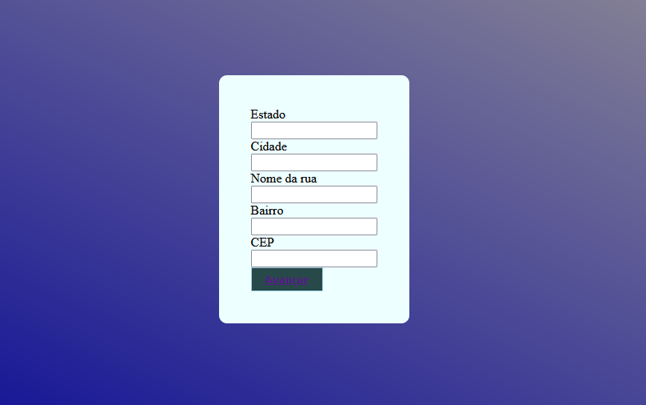

# PROJETO CADECOMMERCE
Projeto criado como parte avaliativa da disciplina de Fundamentos de Desenvolvimento Web ministrada pelo professor Leonardo Rocha.
 
## Ìndice
 
* [Descrição](#descrição)
* [Tecnologias](#tecnologia)
* [Referencia](#referência)
* [Autor(a)](#autora)
 
### Descrição
O projeto consiste em três arquivos HTML nos quais são, index.html, endereco.html e final.html, uma demonstração de como criar um cadastro em uma loja virtual, que ira pedir seus dad0s de endereço e dados pessoais.
 
 
#### Arquivo HTML
  A seguir será possivel visualizar os elementos usados na estrutura HTML do arquivo index.html, endereco.html e final.html:
 
 
* `Main`: Entende-se como conteúdo principal aquele relacionado diretamente com o tópico central da página ou com a funcionalidade central da aplicação.
 
* `label` : Ela especifica qual o “rótulo” do input (a que se refere o input, como, por exemplo, envolvê-la em um texto “Nome completo”), e ajuda na experiência do usuário e usuária durante a utilização e preenchimento do formulário.
 
 
* `form`: O elemento <form> é o elemento que formalmente define o formulário e os atributos que definem a maneira como esse formulário se comporta.
 
Veja a imagem a seguir onde sera possivel ver os elementos mencionados acima:
 

 
* `input`: Componente que permite a entrada de dados textuais por parte do usuário.
 
* `textarea`- é um campo de entrada de texto que permite que seu aplicativo aceite um valor de texto potencialmente longo do usuário.
 
* `button`-representa um botão clicável.
 
Veja a imagem a seguir onde é possivel visualizar os elementos mencionados acima:
 

 
 
### Propriedades CSS
 
 * ``height``: A propriedade "height" no HTML é utilizada para definir a altura de um elemento.
 
* `padding`: A propriedade padding define uma a distância entre o conteúdo de um elemento e suas bordas. É um atalho que evita definir uma distância para cada lado separadamente ( padding-top , padding-right , padding-bottom , padding-left ).
 
* `display- flex`: O display: flex funciona de uma maneira diferente dos outros displays. Quando colocamos essa propriedade em um elemento, esse elemento se torna um flex container, a partir daí podemos manipular todos os elementos filhos desse flex container com propriedades novas.
 
A seguir será possivel visualizar os elementos mencionados a cima:
 

 
* `background-color`: Utilizamos essa propriedade para alterar a cor do plano de fundo, seja de um elemento ou do documento como um todo. Para isso, basta atribuir a cor desejada à propriedade background-color, declarada dentro do seletor no qual ela deve ser aplicada.
 
 * `width` : A propriedade CSS width determina a largura da área de conteúdo de um elemento
 
* `Border`: A propriedade border adiciona um contorno ao redor do conteúdo do elemento HTML.
 
* `Border Radius`: O border radius é uma propriedade CSS que permite adicionar cantos arredondados a um elemento, essa propriedade é usada para arredondar os cantos de um elemento especificado, ele pode ser aplicado a qualquer elemento HTML.
 
* `Color`: A propriedade color é utilizada para definir a cor do texto de um elemento HTML. Quando aplicada a um elemento, o texto dentro dele terá a cor definida.
 
* `font-weight`: A propriedade font-weight é utilizada para aplicar ou remover negrito de um elemento de texto.
 
 Veja a imagem a seguir onde é possivel visulizar os elemntos mencionados acima:
 

 
 
* `flex-direction: column; function` :   A propriedade flex-direction permite alterar a direção na qual os elementos flex serão exibidos ao longo do eixo principal. Definindo a propriedade flex-direction como row-reverse (linha reversa) ainda teremos os elementos dispostos em uma linha, entretanto, as linhas inicial e final serão trocadas
 
* ` align-items: center;`:  O align-items: center garante que os flex-items dentro de um elemento com display flex vão centralizar (verticalmente e horizontalmente).
 
* `background-image: linear-gradient`: A função linear-gradient() é utilizada em conjunto com propriedades que aceitam a aplicação de imagem, entre elas background-image, border-image, entre outras. Na prática, ela cria um efeito degradê em forma linear e é aplicada como uma imagem de fundo — CSS background gradient.
             
A seguir sera possivel visualizar os elementos mencionados acima:
 
 
 
### Resultado do projeto
 
Veja a seguir a imagem onde é possivel ver o resultado final do projeto:

 
## Tecnologia
 
A seguir estará listado as tecnologias que foram utilizadas para este arquivo HTML:
 
 
* HTML5
* CSS3
* GIT
* GITHUB
 
## Referência
[Alura](https://www.alura.com.br/artigos/como-criar-um-readme-para-seu-perfil-github) Como criar um README para o seu perfil do GitHub
 
 
## Autor(a)
 
`Este projeto foi desenvolvido por:`
 
Joao Pedro
 
 
